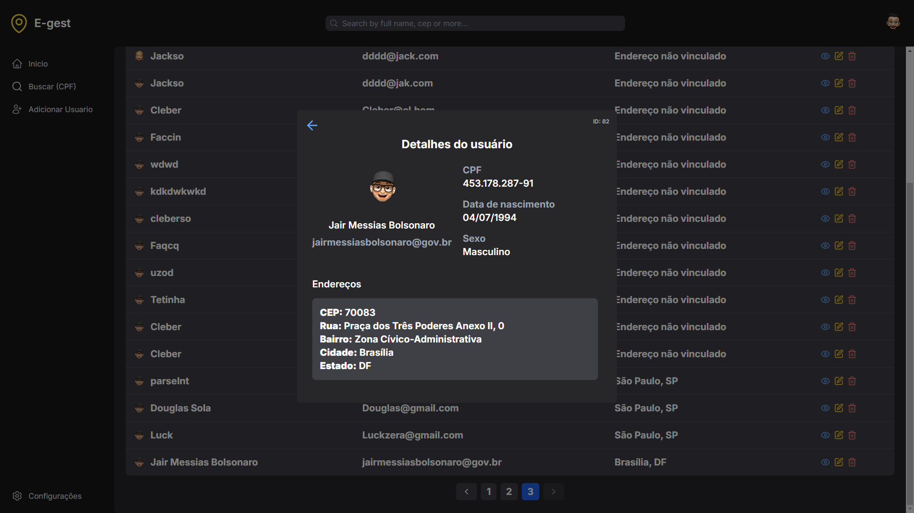
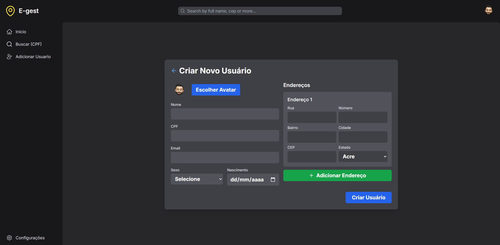
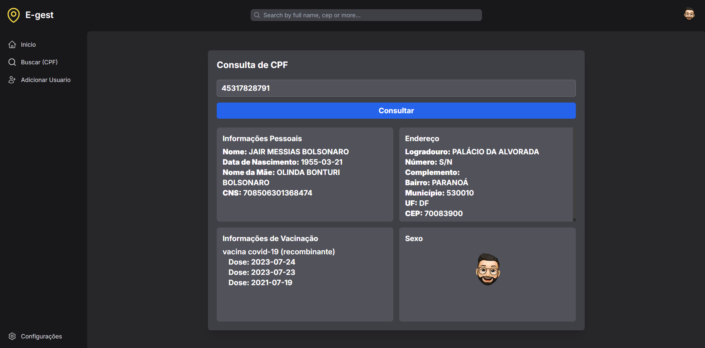
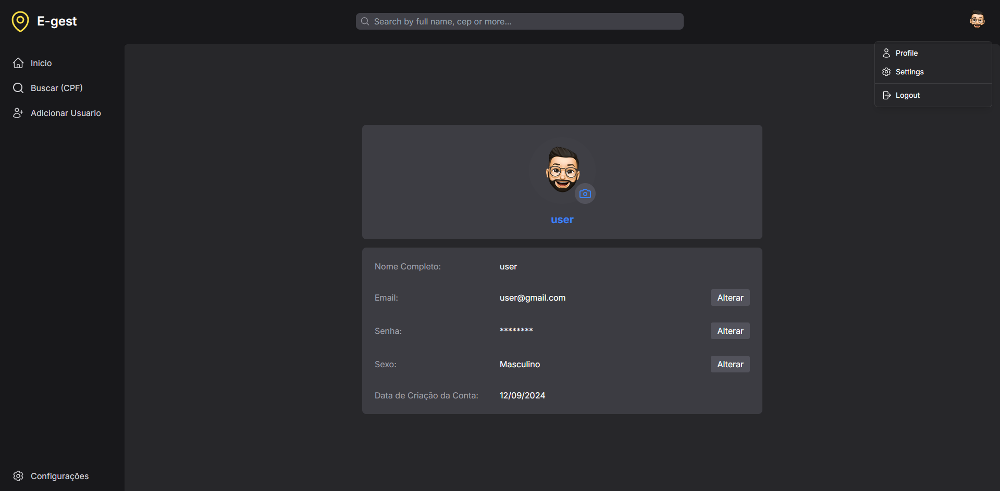
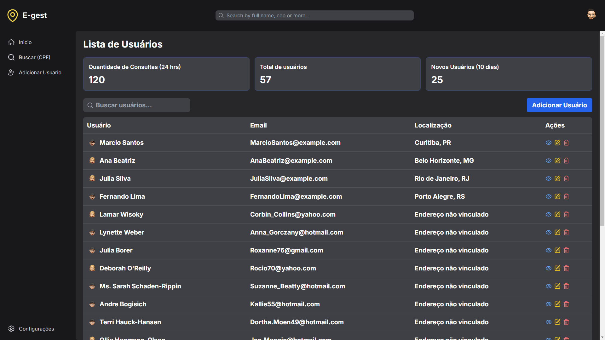

# e-Gest - People and Address Management System

**e-Gest** is a management system designed for the efficient handling of people and addresses, offering complete functionalities for registration, viewing, and searching for people by CPF, and much more. Developed with a modern and pleasant interface using **React**, **Next.js**, and **Tailwind CSS**.


## Features

### 🔐 User Authentication

- **Login**: A secure and simple authentication system.
- **Registration**: Allows new users to sign up with data validation.

<video autoplay loop muted playsinline width="600">
  <source src="./public/videos/login.mp4" type="video/mp4" >
  Your browser does not support the video tag.
</video>

### 👤 People Management

- **View People**: Displays detailed data of people, such as name, email, address, and a personalized avatar.
- **Search by CPF**: Perform fast and efficient searches for people based on their CPF.
- **Register People**: Register new people in the system with data validation.
- **Register Addresses**: Register different addresses linked to people in the system with data validation.

<div style="display: grid; grid-template-columns: repeat(2, 400px); gap: 10px;">
  
  
  
  
</div>

### 📊 Control Panel

- **Dashboard**: An intuitive interface for managing and viewing people and address data.

  

## Technologies Used

- **Front-end**:
  - React with TypeScript
  - Next.js for page rendering
  - Tailwind CSS for styling
  - Framer Motion for animations
  - Lucide-react for icons

## How to Run the Project

1. Clone this repository:

   ```bash
   git clone https://github.com/Faccin27/e-gest_front-end.git


2. Install the dependencies:

   ```bash
   npm install
   ```

3. Run the project:

   ```bash
   npm run dev
   ```

4. Access the project in the browser:
   ```
   http://localhost:8080
   ```

## Back-end Repository

You can access the project's back-end repository  [here](https://github.com/Faccin27/e-gest_back-end).

## Contributions

Contributions are welcome! Feel free to open a PR or report issues.

